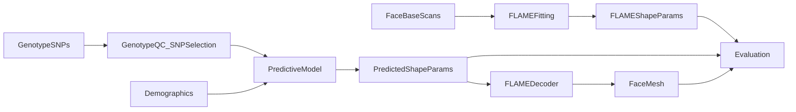

# Facecon — Project Context

**Facecon: Genotype-to-3D-Face Prediction System**

| | |
|---|---|
| **Institution** | National University of Computer and Emerging Sciences, Department of Computer Science, Lahore |
| **Advisor** | Ms. Rushda Muneer |
| **Group** | Ahmed Javed (23L-0644), Afnan Asif (23L-0709), Saad Riaz Taqi (23L-0669) |

This document is the project specification for Facecon. It supports report sections: Introduction, Project Vision, Literature Review and Related Applications, Software Requirement Specifications, Proposed Approach and Methodology, and High-level and Low-level Design.

---

## 1. Introduction

Facial shape is partly controlled by genetics. Predicting aspects of 3D facial morphology from DNA is relevant to forensics, anthropology, and medical genetics [4]. Classical work links genotype to face through genome-wide association studies (GWAS) and statistical models on landmarks or shape scores [5]. More recent AI systems treat the problem like multimodal generation: map genetic variants and facial geometry into a shared representation, then predict a face from genotype.

Reconstructing a full 3D face from DNA alone remains an open problem. Difface showed that deep learning can map single-nucleotide polymorphisms (SNPs) to 3D facial meshes [1], but it was trained on private Han Chinese data with an unpublished SNP list. Independent commentary argues that reported performance may reflect age, sex, and ancestry more than true individual genetic signal, and that evaluation standards are weak [2]. Because data and methods are not fully open, other teams cannot easily verify or reuse that work.

**Facecon** addresses this gap by building a reproducible SNP-to-3D-face pipeline on the controlled but documented **3D Facial Norms (3DFN)** resource: genotypes from dbGaP and 3D facial scans from FaceBase [6], [7]. Rather than copying Difface’s fixed 7,842-SNP design and undisclosed mesh template [1], Facecon uses its own documented SNP panel and a shared **FLAME** face representation [3]. FaceBase scans are fitted to FLAME so every subject shares one mesh topology. The model predicts FLAME shape (identity) parameters from genotype; FLAME then produces the 3D mesh.

The central research framing is not simply “Can DNA generate a face?” but:

> How much individual 3D facial information can be predicted from genotype beyond information already available from demographics and population structure?

---

## 2. Project Vision

### 2.1 End-to-end pipeline

```text
Genotype / SNP data
  → genotype preprocessing and QC
  → SNP feature representation
  → predictive model (+ optional demographics)
  → FLAME shape / identity parameters
  → FLAME decoder
  → reconstructed 3D facial mesh
  → quantitative evaluation
```

### 2.2 Vision statement

Facecon aims to deliver a scientifically careful, undergraduate-defensible system that:

1. Uses paired 3DFN subjects (genotype + 3D scan).
2. Standardizes faces with FLAME so training targets are comparable across subjects.
3. Predicts facial shape parameters from SNPs with clear baselines and ablations.
4. Separates genetic contribution from demographic and ancestry-related signal.
5. Documents SNP selection, preprocessing, and evaluation so results can be interpreted honestly.

### 2.3 Success criteria

The project is successful if it delivers:

- A reproducible genotype-to-FLAME pipeline
- Documented genotype QC and SNP selection
- Documented scan-to-FLAME fitting
- Multiple baselines (mean face, demographics-only, SNP models)
- At least one neural prediction model
- Rigorous quantitative evaluation and ablations
- Clear limitations and ethical discussion
- Working visualizations / system demo
- A complete university FYP report / thesis

### 2.4 Non-goals

Success does **not** require:

- Photorealistic texture or appearance
- Operational forensic identification
- Beating Difface on its private dataset
- A diffusion model or large Transformer by default
- Journal publication (publication is optional)

The project must not claim that DNA uniquely reconstructs a person’s exact face. Preferred wording: the model predicts components of 3D facial morphology from genotype under the evaluated dataset and conditions.

---

## 3. Literature Review and Related Applications

### 3.1 Genetics of facial morphology

Facial traits are heritable and polygenic. Large GWAS studies associate common variants with facial dimensions and shape components in European and other cohorts [5]. These studies motivate biologically informed SNP panels for prediction, as opposed to opaque, unreproducible SNP lists.

### 3.2 Forensic DNA phenotyping

Forensic DNA phenotyping predicts externally visible traits from DNA to support investigation when unidentified samples are available [4]. Most deployed or published tools focus on categorical traits (e.g., eye/hair/skin colour) rather than full 3D geometry. Facecon is related to this application area but is scoped as research on 3D shape prediction with explicit limits on individual-level claims.

### 3.3 Statistical genotype-to-face methods

Earlier approaches map SNPs or genetic principal components to landmark coordinates or PCA shape coefficients using linear or other statistical models. These methods are important baselines: they are interpretable, sample-efficient, and often competitive when paired sample sizes are modest.

### 3.4 Deep learning and Difface

Difface (Jiao et al.) is the most visible recent system for DNA-to-3D-face generation [1]. It (1) contrastively aligns a transformer SNP encoder with a SpiralNet face encoder, then (2) uses a diffusion prior in embedding space to reconstruct a 3D mesh. It was trained on about 9,674 Han Chinese subjects with 7,842 GWAS-selected SNPs. The public release does not provide the SNP list, full preprocessing, face template, or pretrained weights in a reusable form.

Wagner et al. comment that facial genetics AI systems need transparent metrics, clear data-flow disclosure, and evaluation that separates demographic signal from individual genetic prediction [2]. Facecon treats Difface as a **reference architecture** (two-stage alignment + generation) rather than a system to reproduce exactly.

### 3.5 3D morphable models and FLAME

Raw 3D scans do not share vertex correspondence across subjects. Morphable models provide a fixed topology and a low-dimensional parameter space. **FLAME** is a widely used articulated head model with linear identity shape space, expression blendshapes, and pose [3]. Facecon uses FLAME so that:

- Every subject is represented with the same mesh structure
- The learning target is preferably FLAME identity/shape coefficients, not tens of thousands of raw XYZ coordinates
- Predicted parameters decode to a full mesh through the FLAME model

### 3.6 3DFN, FaceBase, and dbGaP

The 3D Facial Norms Database provides high-quality craniofacial anthropometry and 3D facial surface models through FaceBase [6]. Genotypes for related normal facial variation analyses are available via dbGaP accession `phs000949` [7]. Together they enable a documented, controlled-access paired genotype–phenotype setting suitable for academic research when institutional approvals are in place.

### 3.7 Related applications (careful scope)

Possible application contexts include:

- Research support for craniofacial genetics
- Educational and methodological benchmarks for genotype-to-phenotype modeling
- Exploratory forensic research (not operational identification)

Facecon does not position itself as a ready forensic identification tool.

---

## 4. Software Requirement Specifications

### 4.1 Functional requirements

| ID | Requirement |
|---|---|
| FR1 | Ingest genotype data and build a subject × SNP dosage matrix |
| FR2 | Perform genotype QC and produce a documented SNP panel |
| FR3 | Ingest 3D facial scans / meshes and associated demographics |
| FR4 | Fit or register scans to FLAME and export shape/identity parameters |
| FR5 | Match subjects with both valid genotype and valid FLAME targets |
| FR6 | Train and run predictive models: demographics-only, SNP-only, and combined |
| FR7 | Decode predicted FLAME parameters to a 3D mesh |
| FR8 | Evaluate predictions with parameter, mesh, landmark, region, and retrieval metrics |
| FR9 | Compare against mean-face and demographic baselines; run SNP ablations |
| FR10 | Export meshes, metrics, plots, and a working demonstration |

### 4.2 Inputs

- **Genotypes:** SNP dosages (typically 0 = homozygous reference, 1 = heterozygous, 2 = homozygous alternate), after QC
- **Demographics:** age, sex, and ancestry-related variables or genotype PCs where scientifically justified
- **Faces:** FaceBase 3D scans fitted to FLAME; training target `Y_face` = FLAME identity/shape coefficient vector
- **Optional covariates:** as supported by 3DFN metadata

Conceptual tensors:

- `X_snp`: `[n_subjects × n_snps]`
- `X_demo`: `[n_subjects × n_demographic_vars]`
- `Y_face`: `[n_subjects × n_flame_shape_params]`

### 4.3 Outputs

- Predicted FLAME shape/identity parameters
- Decoded 3D facial mesh (e.g., OBJ)
- Quantitative metric tables and figures
- Ablation and baseline comparison results
- Demo visualization of predicted vs. true (or baseline) meshes

### 4.4 Non-functional requirements

| ID | Requirement |
|---|---|
| NFR1 | Subject-level train/validation/test splits; no subject leakage |
| NFR2 | SNP selection and normalization statistics fit only on training data when derived from this dataset |
| NFR3 | Experiment configs for reproducible runs |
| NFR4 | Model complexity chosen according to final paired sample size |
| NFR5 | Runnable for core baselines and small neural models on student hardware (e.g., RTX 3050 4 GB); heavier training may use university GPU |
| NFR6 | Honest reporting: confidence intervals / repeated evaluation where feasible; no overclaiming |
| NFR7 | Ethical handling of controlled genetic and biometric data under approved data-use terms |

### 4.5 Data constraints

- Primary data are controlled-access (FaceBase + dbGaP).
- Exact usable paired sample count is unknown until access and QC are complete.
- If paired N is small, prefer simple models and strong baselines over large deep architectures.

### 4.6 Software dependencies (conceptual)

- Python scientific stack (NumPy, SciPy)
- PyTorch for neural models
- FLAME 2020 model files (licensed academic download)
- Mesh I/O / geometry utilities (e.g., trimesh)
- Genotype tooling as needed (e.g., PLINK-style QC workflows)
- Experiment configuration and plotting utilities

---

## 5. Proposed Approach and Methodology

### 5.1 Dataset

Use 3DFN subjects with **both**:

- Genotype data from dbGaP (`phs000949`) [7]
- 3D facial scans and related phenotype resources from FaceBase [6]

After access, inspect formats, missingness, demographics, scan quality, and subject-ID overlap before choosing final model capacity.

### 5.2 Genotype preprocessing and SNP selection

Typical pipeline elements:

- Missing-genotype and subject/SNP missingness filters
- Minor allele frequency filtering
- Hardy–Weinberg filtering where appropriate
- Imputation or missing-value handling
- Linkage-disequilibrium pruning if required
- SNP standardization
- Optional ancestry/PC covariates

SNP selection must be documented (rsID, chromosome, position, locus, facial trait association, source paper, inclusion reason). Facecon does **not** blindly copy Difface’s 7,842-SNP panel [1].

Experimental SNP comparisons:

1. Facial-GWAS-informed SNPs [5]
2. Matched random / common SNPs
3. Larger QC-filtered panels if sample size allows

### 5.3 Face preprocessing (FLAME)

```text
FaceBase 3D scan
  → normalization / alignment
  → landmark initialization
  → FLAME fitting / registration
  → FLAME identity / shape coefficients
  → standardized training target Y_face
```

Preferred prediction target: FLAME shape/identity parameters. Mesh XYZ may be used for evaluation after decoding.

### 5.4 Modelling strategy

Architecture inspiration from Difface’s two-stage idea is allowed [1], but implementation is Facecon’s own and FLAME-based [3].

**Required progression (baselines before complexity):**

1. Mean face
2. Demographics → face (linear / regression)
3. SNPs → Ridge
4. SNPs → MLP
5. SNPs + demographics → MLP
6. Larger MLP if justified
7. Transformer SNP encoder if justified
8. Contrastive SNP–face representation if justified
9. Generative / diffusion prior only if dataset size and experiments justify it

**First complete neural path:**

```text
SNP vector → MLP → FLAME shape coefficients → FLAME mesh
```

Proposal-level advanced path (optional, after baselines):

- Stage 1: SNP encoder (transformer or MLP) + face encoder; CLIP-style contrastive alignment
- Stage 2: map SNP features to face features (e.g., diffusion or simpler regressor), then FLAME decode

A scientifically valid outcome may be that simple models match or beat complex ones.

### 5.5 Research questions

- **RQ1:** Can a reproducible SNP-to-3D-face pipeline be built on 3DFN/FaceBase with FLAME as the common face representation?
- **RQ2:** How accurately can SNPs predict 3D facial shape versus mean-face and demographic-only baselines?
- **RQ3:** Does adding SNPs to demographics improve 3D facial prediction?
- **RQ4:** Do facial-GWAS-informed SNPs outperform matched random/common SNPs?
- **RQ5:** How do simple statistical and neural models compare with more complex deep models?
- **RQ6:** Which facial regions or FLAME components show the strongest predictable signal?
- **RQ7 (optional):** How well does prediction generalize across demographic/ancestry subgroups if sample sizes allow?

### 5.6 Evaluation

Build evaluation before final model claims.

1. **FLAME parameter error:** MSE, RMSE, MAE, per-component correlation  
2. **Mesh error:** per-vertex distance; mean/median vertex error  
3. **Landmark error:** anatomical landmark distances  
4. **Region analysis:** nose, jaw, mouth, eyes, cheeks, forehead, whole face  
5. **Retrieval-style ranking:** Top-1 / Top-5 / mean rank of true face among candidates (scientific metric only; not marketed as forensic ID)  
6. **Baseline comparisons:** mean face, demographics-only, SNP-only, SNP+demographics  
7. **Ablations:** GWAS vs random SNPs; panel size; remove demographics; architecture comparison  

Always interpret small gains honestly (e.g., demographics 4.2 mm vs SNP+demographics 4.18 mm means little added genetic signal under that setup).

### 5.7 Experimental integrity

- Subject-level splits only
- No test leakage into SNP discovery, PCA, or normalization
- External GWAS SNP lists must be cited; within-dataset SNP selection only inside training folds
- Separate genetics vs demographics vs ancestry contributions in reporting
- Discuss privacy, misuse risk, ancestry bias, and uncertain individual-level accuracy

---

## 6. High-level and Low-level Design

### 6.1 High-level architecture



### 6.2 Low-level module design

Suggested codebase separation:

```text
project/
├── data/              # genotype_loader, phenotype_loader, subject_matching, synthetic_data
├── preprocessing/     # genotype_qc, snp_selection, face_alignment, normalization
├── flame/             # flame_model, scan_fitting, landmarks, mesh_utils
├── models/            # mean_face, linear, ridge, mlp, transformer, contrastive
├── training/          # dataset, train, losses
├── evaluation/        # metrics, mesh_metrics, retrieval, region_analysis, plots
├── experiments/
├── configs/
├── notebooks/
└── README.md
```

### 6.3 Model inventory

| Model | Input | Output | Role |
|---|---|---|---|
| Mean face | — | mean `Y_face` | Baseline 0 |
| Demographic regressor | `X_demo` | `Y_face` | Baseline 1 |
| Ridge | `X_snp` | `Y_face` | Baseline 2 |
| MLP | `X_snp` | `Y_face` | Baseline 3 |
| MLP | `X_snp` + `X_demo` | `Y_face` | Baseline 4 |
| MLP / Ridge | GWAS SNP subset | `Y_face` | Baseline 5 |
| Same model | matched random SNPs | `Y_face` | Baseline 6 |
| Transformer SNP encoder | `X_snp` | latent / `Y_face` | Advanced |
| Contrastive SNP–face | SNP + face embeddings | aligned latents | Advanced Stage 1 |
| Generative prior | SNP embedding | face embedding / shape | Advanced Stage 2 |
| FLAME decoder | shape (+ expr/pose as needed) | mesh vertices | Shared decode |

### 6.4 Interface contracts

- **Genotype interface:** produce `X_snp` and subject IDs interchangeable between synthetic and real data loaders
- **Face interface:** produce `Y_face` (and optionally mesh/landmarks) from FLAME fitting
- **Model interface:** `predict(X_snp, X_demo=None) -> Y_face_hat`
- **Decode interface:** `flame_decode(Y_face_hat) -> vertices, faces`
- **Eval interface:** compare `Y_face_hat` / meshes against held-out targets and baselines

---

## 7. Expected Outcomes

1. Documented end-to-end Facecon methodology (data → FLAME → models → evaluation)
2. Implemented preprocessing and prediction software with reproducible configs
3. Baseline and neural experimental results answering RQ1–RQ6 (and RQ7 if feasible)
4. Evidence on whether SNPs add predictive value beyond demographics under 3DFN conditions
5. Evidence on whether facial-GWAS SNP panels outperform matched random SNPs
6. Working demo (predicted FLAME mesh visualization)
7. Written FYP report / thesis covering introduction through discussion, limitations, and ethics

---

## References

[1] M. Jiao et al., “De novo reconstruction of 3D human facial images from DNA sequence,” *Advanced Science*, 2025. [Online]. Available: https://pmc.ncbi.nlm.nih.gov/articles/PMC12362825

[2] J. K. Wagner, N. Claessens, C. M. Maloney, and P. Claes, “Comment on ‘De novo reconstruction of 3D human facial images from DNA sequence’,” *Advanced Science*, 2025. [Online]. Available: https://pmc.ncbi.nlm.nih.gov/articles/PMC12931204

[3] FLAME. [Online]. Available: https://flame.is.tue.mpg.de/

[4] C. Wang et al., “Forensic DNA phenotyping: a 19-SNP prediction system,” *Forensic Sciences Research*, 2026. [Online]. Available: https://doi.org/10.3788/tfsr20230045

[5] Z. Xiong et al., “Combined GWAS of facial traits in Europeans,” *Nature Communications*, 2025. [Online]. Available: https://www.nature.com/articles/s41467-025-61761-7

[6] M. L. Marazita, S. Weinberg, and Z. Raffensperger, “3D Facial Norms Database,” FaceBase Consortium. [Online]. Available: https://www.facebase.org/resources/human/facial_norms/

[7] National Center for Biotechnology Information, “Genetic Analysis of Normal Human Facial Variation,” dbGaP, accession no. phs000949.v1.p1. [Online]. Available: https://www.ncbi.nlm.nih.gov/projects/gap/cgi-bin/study.cgi?study_id=phs000949.v1.p1
